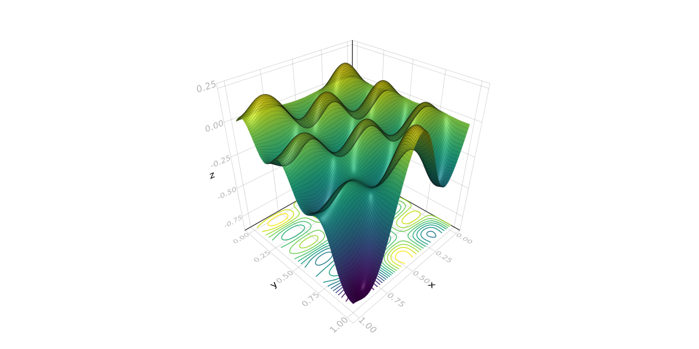
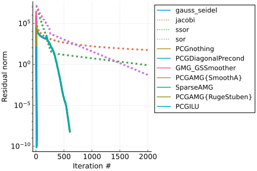
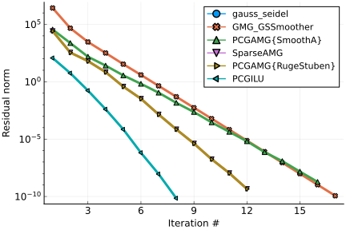
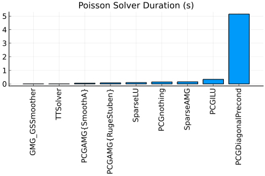

# LidJul.jl

*Disclaimer!!!! This is a Work In Progress that explores the performance of different Poisson's solver. It corresponds to internal exploratory experiments with the objective to build Julia hands-on sessions for TriScale innov professional Julia lectures.*

www.triscale-innov.com

## A simple Geometric Multi-Grid Julia implementation for a 2D Poisson's equation. 
This Julia repo compares the performance of different linear solvers available in classical Julia packages with a *basic Geometric Multi Grid* (GMG) solver adapted from the *Harald Köstler*'s implementation described in the following ref:

"Multigrid HowTo: A simple Multigrid solver in C++ in less than 200 lines of code"
https://www10.cs.fau.de/publications/reports/TechRep_2008-03.pdf

The `src/poisson2DGMG` and `src/GSSmoother.jl` files contain the Julia's GMG implementation  corresponding to a 2D Poisson's equation defined on a unit square with `n x n` steps and a basic FD scheme. Depending on the boundary conditions that can be chosen to be of `Dirichlet` or `Neumann` type for the 4 edges of the square (left,right,bottom,top), one can launch the
resolution of the Poisson's equation for a collection of solvers via the command (from this directory) :


```julia
include("test/poisson2D.jl")
```

By default the solver is launched for a `n=128` and `DNDN` boundary conditions. These values can be modified in the `go()` function defined in `test/poisson2D.jl`. Note that n must be a power of two.

```
function go()
    #Choose a power of two
    n=128
    #Choose boundary conditions 
    # bc=(neumann,neumann,neumann,neumann)
    bc=(dirichlet,neumann,dirichlet,neumann)
    # bc=(dirichlet,dirichlet,dirichlet,dirichlet)
    ...
```




The code should return a collection of measurements corresponding to the CPU time required by each solvers, the number of iterations for the iterative solvers as well as the corresponding residual.


```
┌────────────────────┬───────────┬─────────────┬────────────┬───────────┬─────────┐
│ solver             │ init_time │ solver_time │ Total Time │ residual  │ niters  │
├────────────────────┼───────────┼─────────────┼────────────┼───────────┼─────────┤
│ gauss_seidel       │ 8.900E-08 │ 4.492E-03   │ 4.492E-03  │   NaN     │ 10      │
│ GMG_GSSmoother     │ 7.034E-05 │ 5.264E-03   │ 5.335E-03  │ 1.148E-10 │ 17      │
│ TTSolver           │ 6.101E-03 │ 3.554E-04   │ 6.457E-03  │ 4.886E-11 │ nothing │
│ PCGAMG{SmoothA}    │ 1.383E-02 │ 4.145E-02   │ 5.529E-02  │ 1.916E-09 │ 16      │
│ PCGAMG{RugeStuben} │ 2.825E-02 │ 4.817E-02   │ 7.643E-02  │ 6.521E-10 │ 12      │
│ SparseLU           │ 9.333E-02 │ 6.262E-03   │ 9.959E-02  │ 1.748E-12 │ nothing │
│ PCGnothing         │ 5.100E-08 │ 1.431E-01   │ 1.431E-01  │ 5.959E-09 │ 605     │
│ SparseAMG          │ 8.246E-02 │ 6.945E-02   │ 1.519E-01  │ 6.521E-10 │ 12      │
│ jacobi             │ 5.700E-08 │ 3.014E-01   │ 3.014E-01  │ 9.707E+01 │ 2000    │
│ PCGILU             │ 2.629E-01 │ 7.272E-02   │ 3.356E-01  │ 4.687E-10 │ 8       │
│ sor                │ 3.000E-08 │ 4.922E-01   │ 4.922E-01  │ 6.332E+01 │ 2000    │
│ ssor               │ 3.100E-08 │ 9.461E-01   │ 9.461E-01  │ 6.332E+01 │ 2000    │
│ PCGDiagonalPrecond │ 2.945E-04 │ 5.147E+00   │ 5.148E+00  │ 6.132E-09 │ 602     │
└────────────────────┴───────────┴─────────────┴────────────┴───────────┴─────────┘
```
One can see in particular that the present GMG solver outperforms the available AMG solvers (Algebraic Multi-Grid). The TTSolver is a direct Poisson solver which is restricted to separable Poisson coefficient. 

The code also produce some convergence curves and bar charts for comparing CPU time. 








Note that the full Neumann case can be treated by several iterative methods (including the present GMG). The direct SparseLU is also able to treat this case via a regularization applied to the Laplacian operator. 

## A simple CFD application of the solver (Lid Cavity). 

Finally the GMG solver is used in the Julia translation fo the classical *Benjamin Seibold*'s `MIT18086_NAVIERSTOKES` matlab implementation that simulates a square lid cavity. See the details here: 
http://math.mit.edu/~gs/cse/codes/mit18086_navierstokes.pdf


From this directory run the following command to launch this 2D CFD simulation :


```julia
include("test/mit_implicit.jl")
```


<!--


 -->
[](https://travis-ci.com/{GHUSER}/LidJul.jl)
[](http://codecov.io/github/{GHUSER}/LidJul.jl?branch=master)
