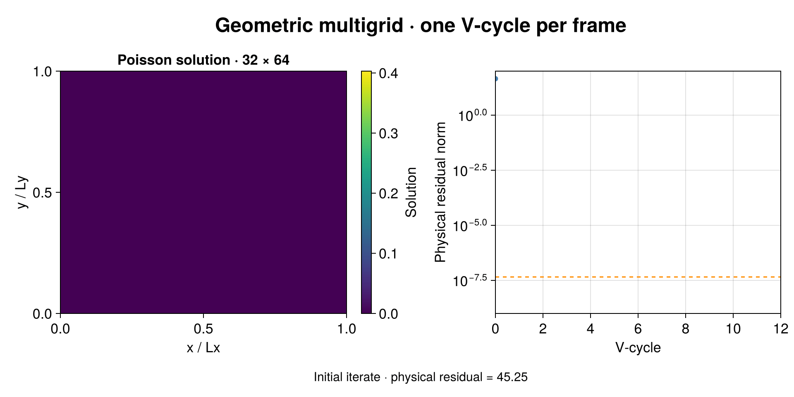

# LidJul.jl

[](https://github.com/triscale-innov/LidJul.jl/actions/workflows/ci.yml)
[](https://triscale-innov.github.io/LidJul.jl/)
[](https://julialang.org/downloads/)
[](LICENSE.md)

**Compare the many methods available in Julia for solving the Poisson equation.**

LidJul's main purpose is to explore and compare Julia's Poisson-solving methods:
direct solvers, stationary iterations, Krylov methods, and algebraic or geometric
multigrid. The benchmarks compare construction cost, solve time, convergence and
allocations under a common physical stopping rule. The six methods in the timing
table are a representative selection; the solver interface also exposes Jacobi,
Gauss–Seidel, SOR and SSOR.

The lid-driven cavity is an application of these solvers: its pressure projection
requires a Poisson solve at every timestep. LidJul supports `Float32` and `Float64`, rectangular domains,
all combinations of Dirichlet/Neumann boundaries, and a common convergence API.
The numerical core runs without a graphics backend; CairoMakie provides figures
and animations without an OpenGL display.

[Documentation](https://triscale-innov.github.io/LidJul.jl/) ·
[Solver guide](https://triscale-innov.github.io/LidJul.jl/solvers/) ·
[Validation](https://triscale-innov.github.io/LidJul.jl/validation/) ·
[Migration to 0.3](https://triscale-innov.github.io/LidJul.jl/migration/)

## Solver performance

The table comes from the checked-in [benchmark report](benchmark/results.toml),
measured with **Julia 1.13.1 on an Apple M1**, one BLAS thread and ten Julia threads
in the process. Each case uses `Float64`, a 1 × 1.5 domain, mixed **D/N/D/N**
boundaries (left/right/bottom/top), and a physical relative residual tolerance of
**10⁻⁸**. All cases converged.

<!-- benchmark-table:start -->

| Solver | Solve 16 × 32 (ms) | Solve 32 × 64 (ms) | Solve 64 × 64 (ms) | Setup 64 × 64 (ms) | Method / iterations at 64 × 64 |
|:--|--:|--:|--:|--:|--:|
| Tensor | 0.007 | 0.036 | 0.081 | 0.321 | Direct |
| SparseLU | 0.016 | 0.073 | 0.162 | 4.111 | Direct |
| GMG | 0.082 | 0.291 | 0.702 | 0.015 | 10 |
| ILU + GMRES | 0.079 | 0.458 | 1.509 | 14.703 | 4 |
| AMG | 0.260 | 1.384 | 3.232 | 1.723 | 7 |
| CG | 0.306 | 2.670 | 7.706 | 0.159 | 303 |

<!-- benchmark-table:end -->

Times are minimum warmed trials, with 13–20 solve samples in this selection.
“Direct” identifies methods that compute a solution without an iterative
convergence loop; numerical iteration counts apply to the iterative methods.
Construction is separate; every cached solve starts from zero and excludes
history storage. These measurements illustrate the setup/solve tradeoff;
other grids, operators and hardware can change the ranking.


The tensor solver exploits the separable Cartesian operator. Sparse LU amortizes
its factorization across repeated right-hand sides. GMG has a small setup cost
and uses red-black smoothing with a direct coarse solve. AMG, ILU with GMRES,
and unpreconditioned CG provide sparse iterative alternatives.
See the [benchmark methodology](https://triscale-innov.github.io/LidJul.jl/benchmarks/)
for all **216 cases**, tolerances, allocations and environment metadata.

## Poisson in action: the lid-driven cavity


*A computed transient at Re = 100: 64 × 64 cells, dt = 0.005, t up to 15.
The lid moves to the right. Smooth streamlines and arrows follow the interpolated
staggered velocity field; the background shows speed on a fixed, square-root color scale.
The centerline profile and divergence come from the same simulation.*

## Watch multigrid converge



*A 32 × 64 mixed-boundary problem: each advancing frame applies one V-cycle.
The dashed line is the stopping threshold. This run converges in 11 cycles;
the animation pauses on the final solution.*

## Try it

```sh
git clone https://github.com/triscale-innov/LidJul.jl.git
cd LidJul.jl
julia --project=. -e 'using Pkg; Pkg.instantiate()'
```

Solve Poisson and reuse the prepared solver:

```julia
using LidJul

lap = Laplacian2D(32, 64, 1, 1.5, dirichlet, neumann, dirichlet, neumann)
solver = PoissonGMG(lap)
x = zeros(32, 64)
result = solve!(x, ones(32, 64), solver; reltol=1e-8)
@assert result.converged
```

Run the cavity without opening a window:

```julia
flow = simulate_cavity(CavityConfig(Re=100, nx=32, dt=0.005, tf=15))
divergence_norm(flow.state)
```

Recreate the animations and timing plot:

```sh
julia --project=examples -e 'using Pkg; Pkg.instantiate()'
julia --project=examples examples/readme_media.jl
```

The optional desktop backend lives in `examples/interactive/`; see the
[graphics guide](https://triscale-innov.github.io/LidJul.jl/cavity/) for GLMakie
and headless execution.

## Numerical validation

Tests cover all 16 boundary combinations, both scalar types, rectangular grids,
Neumann compatibility, warm starts, workspace reuse, cavity walls and pressure
projection. The suite contains **1,955 assertions** and runs on Linux, macOS and
Windows, together with executable command-line examples.

At Re = 100, the recorded 64 × 64 cavity centerlines differ from Ghia et al.'s
published samples by **0.33% RMS** of the lid velocity. Successive grid-profile
differences decrease by a factor of **3.98**, consistent with second-order
spatial accuracy. The published finite-grid reference and our refinement study
are distinguished in the [validation report](https://triscale-innov.github.io/LidJul.jl/validation/).


```sh
julia --project=. -e 'using Pkg; Pkg.test()'
julia --startup-file=no --project=. test/cli_smoke.jl
```

## Documentation and reproducibility

The English [Documenter site](https://triscale-innov.github.io/LidJul.jl/) is built
with doctests and published to **GitHub Pages on pushes to `master`**. Pull
requests build and check the documentation without publishing it.

```sh
julia --project=docs -e 'using Pkg; Pkg.instantiate()'
julia --project=docs docs/make.jl
```

Open `docs/build/index.html` for the local site. Separate `benchmark/`, `examples/`
and `docs/` environments record their dependencies. Reports, plotting code and
animation generators are included; [historical experiments](archive/README.md)
are preserved with their original provenance.

The multigrid work builds on Harald Köstler's *Multigrid HowTo*; the cavity work
draws on Benjamin Seibold's *MIT18086 Navier–Stokes* example. Reference profiles
come from [Ghia, Ghia and Shin (1982)](https://doi.org/10.1016/0021-9991(82)90058-4).
LidJul is distributed under the [MIT license](LICENSE.md).
