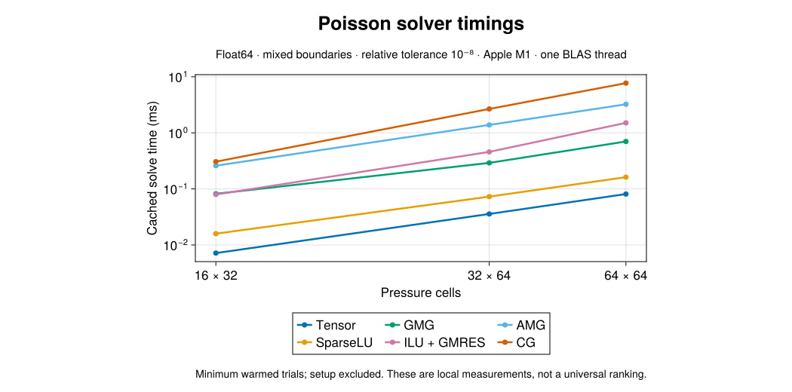
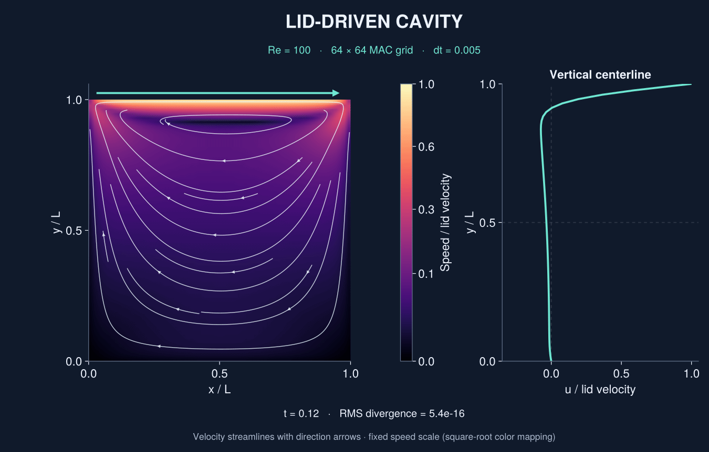

```@meta
CurrentModule = LidJul
DocTestSetup = :(using LidJul)
```

# LidJul.jl

LidJul's main purpose is to compare the many methods available in Julia for
solving the Poisson equation: direct solvers, stationary iterations, Krylov
methods, and algebraic or geometric multigrid. Construction cost, repeated solve
time, convergence and allocations are compared using a common physical residual.
The six methods in the timing table are a representative selection; Jacobi,
Gauss–Seidel, SOR and SSOR are also available through the solver interface.

The two-dimensional lid-driven cavity demonstrates an application of these
solvers through a Poisson pressure projection at each timestep. The numerical
core runs without a graphics backend and supports Julia 1.13, `Float32`, and
`Float64`.

## Compare the solvers



The [benchmark guide](@ref Benchmarks) separates construction from repeated
solves and reports all 216 accuracy-checked cases. The six methods share the
same physical stopping rule.

## Poisson in action: the lid-driven cavity



This actual 64 × 64 transient at Re = 100 shows speed, smooth velocity
streamlines with direction arrows, centerline velocity and measured divergence,
up to t = 15. Streamlines follow the interpolated staggered velocity field;
the square-root speed color scale remains fixed throughout the animation.
Reproduce it with `julia --project=examples examples/readme_media.jl`.

## Installation

From a checkout of this repository:

```sh
julia --project=. -e 'using Pkg; Pkg.instantiate(); Pkg.test()'
```

Use Julia's current stable release through `juliaup update release`. This
migration was verified with Julia 1.13.1. Dependencies are specified by compatible
version ranges; the manifests record the exact versions used locally.

## First solve

```jldoctest
julia> lap = Laplacian2D(8, 16, 1, 2, dirichlet, dirichlet, dirichlet, dirichlet);

julia> x = zeros(8, 16); b = ones(8, 16);

julia> result = solve!(x, b, PoissonTTSolver(lap); reltol=1e-10);

julia> result.converged && result.iterations == 1
true
```

The constructor returns a solver, and `solve!` returns a [`SolveResult`](@ref).
Setup work is cached. Reuse the same solver when the operator stays unchanged.

## Environments

| Environment | Purpose |
|:--|:--|
| Repository root | Numerical package and its tests |
| `docs/` | Documenter documentation and doctests |
| `examples/` | Optional PlotlyBase and CairoMakie visualization |
| `examples/interactive/` | Optional desktop OpenGL backend |
| `benchmark/` | Reproducible timing and allocation measurements |
| `archive/` | Historical experiments preserved for provenance |

Build this documentation with:

```sh
julia --project=docs -e 'using Pkg; Pkg.instantiate()'
julia --project=docs docs/make.jl
```

The build checks all exported docstrings and treats documentation errors as
failures. Open `docs/build/index.html` after a successful build.
Pushes to `master` also publish the generated site to
[GitHub Pages](https://triscale-innov.github.io/LidJul.jl/). Pull requests build
and check the documentation without deploying it.
