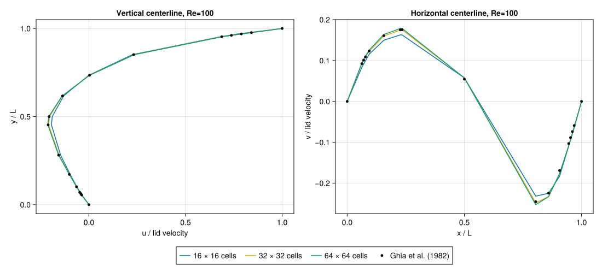

```@meta
CurrentModule = LidJul
DocTestSetup = :(using LidJul)
```

# Validation

## Automated regression tests

The final local `Pkg.test()` run passed **1,955 assertions** with bounds checks
enabled and two Julia threads. The suite checks the independent Kronecker assembly, all 16 homogeneous
boundary combinations, rectangular grids, `Float32`/`Float64`, solver stopping
contracts, warm starts, physical Neumann residuals, zero-mean gauges, invalid
inputs, cached allocations and independent concurrent solver instances.
A manufactured smooth Dirichlet solution verifies second-order Poisson grid
convergence. Headless cavity tests verify wall conditions, pressure gauges,
projection divergence, stationary-lid behavior, timestep refinement and all
four selectable pressure solvers. Plotly extension tests check slider structure
and HTML export without a display server.

## Published cavity reference

The offline data in `validation/ghia_re100.csv` are the Re=100 column of Tables I
and II in U. Ghia, K. N. Ghia and C. T. Shin, *High-Re solutions for incompressible
flow using the Navier-Stokes equations and a multigrid method*, Journal of
Computational Physics 48 (1982), 387–411,
[DOI 10.1016/0021-9991(82)90058-4](https://doi.org/10.1016/0021-9991(82)90058-4).
The original calculation uses a 129×129 grid. Coordinates are retained at their
published precision. These samples are numerical benchmark data, not an exact
solution of the continuum equations.

From the benchmark environment:

```julia
using LinearAlgebra
BLAS.set_num_threads(1)
include("validation/cavity_reference.jl")
report = cavity_validation(output="validation/results.toml")
```

This runs 16², 32² and 64² grids to a measured steady tolerance, samples both
centerlines by linear interpolation, and reports RMS/max velocity differences
in lid-velocity units. It requires decreasing differences between successive grids, a fine-grid RMS
reference error below 0.01, accurate projection and wall conditions. The
published data are a finite-grid numerical reference: their error need not
decrease monotonically under refinement of a different discretization. A separate transient
study halves the timestep at fixed grid. The report records actual timesteps,
final times, steps, divergence and velocity-change diagnostics.

The extended study is available separately because steady runs take longer than
unit tests. Its results do not certify other Reynolds numbers, particularly the
historical Re=10⁴ experiments. High-Re runs need their own resolution and
stability studies; corner singularities and projection splitting can limit the
observed convergence rate.

## Local measurements

The checked-in `validation/results.toml` records the executed study with Julia
1.13.1 and one BLAS thread. Re=100, `dt=0.0025`, central convection and a pressure
relative tolerance of `1e-11` were used. Runs stopped at a velocity-change
threshold of `1e-7`, at about t=24.7–24.8.

| Grid | RMS error to Ghia | Maximum error to Ghia | Maximum projection divergence |
|:--|--:|--:|--:|
| 16² | 0.009046 | 0.018826 | 3.43e-16 |
| 32² | 0.002696 | 0.008421 | 1.47e-15 |
| 64² | 0.003330 | 0.008559 | 1.05e-14 |

The RMS difference between the 16²/32² profiles is 0.008643; between 32²/64² it
is 0.002173. The ratio is 3.98, corresponding to an observed order near two for
these sampled centerlines. Agreement with the finite-grid Ghia data is not
monotone; both finer grids stay within 0.86% maximum and 0.34% RMS of the lid
velocity. This distinguishes observed grid convergence from agreement with a
particular numerical reference.

At fixed 16² grid and t=0.4, errors to the finest transient timestep are 0.037149
for `dt=0.02` and 0.012422 for `dt=0.01`, against `dt=0.005`. A separate regression
checks that the incremental projection gives the same converged steady velocity
when the timestep is halved.



Recreate the figure using `examples/validation_plot.jl` in the examples environment:

```julia
include("examples/validation_plot.jl")
save("cavity_reference.svg", validation_plot())
```

CairoMakie static exports and the modern Poisson/multigrid examples were executed
locally. The optional GLMakie backend encountered a native precompilation crash
(signal 11 in GLFW's macOS monitor-position query). GLFW reports zero monitors
and a null primary monitor in this session. Disabling GLMakie's optional
precompile workload in the interactive project makes importing the backend
succeed; desktop rendering remains unverified. CairoMakie provides the verified
path for graphics without OpenGL.

The command-line smoke check is independently executable:

```sh
julia --startup-file=no --project=. test/cli_smoke.jl
julia --startup-file=no --project=docs docs/make.jl
```

Both commands passed locally in fresh Julia 1.13.1 processes. GitHub Actions
runs the smoke check on three operating systems and uploads the documentation
build as an HTML artifact. Remote job outcomes are reported by GitHub Actions.
